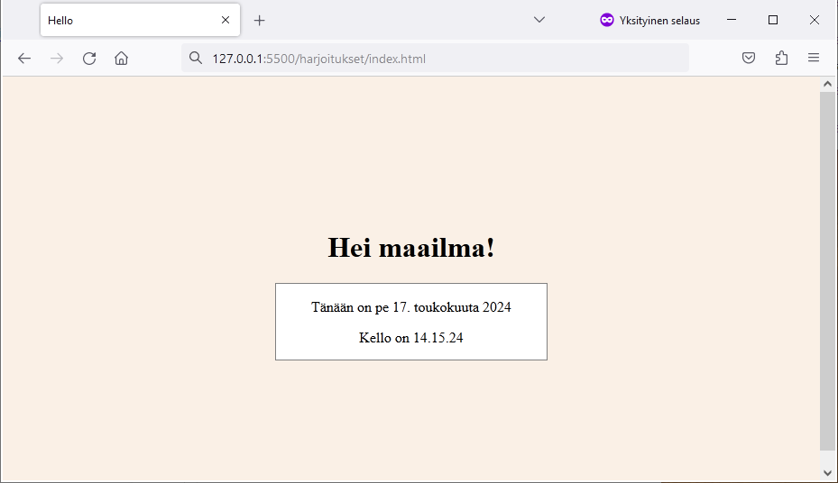

# Git-versionhallinta -kurssin (SOF011AS2A-3001) harjoitusprojekti
Tekijä: Dovile Martinonyte

Tämä harjoitusprojekti on osa Git-versionhallinta -kurssia, jonka oppimispäiväkirja löytyy [tästä](https://github.com/dovile-mart/git-oppimispaivakirja).

Kurssin tavoitteena oli oppia ja kerrata git-versionhallintajärjestelmän perusteita soveltamalla projektityössä. 

Projektissa harjoittelin kehityshaaran luontia ja siinä työskentelyä tiimiläisen (botin) kanssa. Ratkaisin konfliktin sekä yhdistin kehityshaarasta lopullisen version päähaaraan.

Kuvakaappaus lopputuloksesta:
